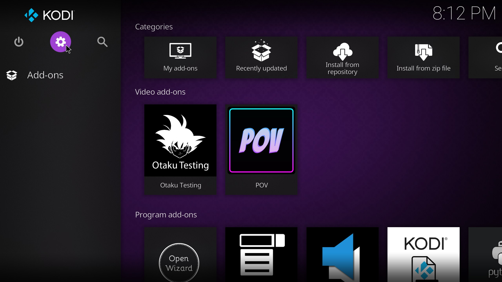

# POV
## POV is an add-on that allows you to stream movies and TV shows from premium sources. Based on Fen, POV is very fast, and it has many of the features from its predecessor. Its also the easiest to setup, having a scraper module built-in which removes a long step that the other popular add-ons require to function.
> [!WARNING]
> - Requires at least one paid premium provider (eg.Real Debrid, Premiumize, All-Debrid, etc.)
> - Requires a Watchlist Provider to keep track of your watch history across devices and access categories for streaming service-like browsing (Popular, Trending, Genres)
#
> [!IMPORTANT]
> ## Installation:
> 1. Open up Kodi Settings ( ⚙️ )
> 
> 
> 2. Go to the Kodi file manager
> 
> 4. Click on "Add source"
> 
> 5. Click on Enter Path...
> 
> 6. Enter the path for POV: https://kodifitzwell.github.io/repo/ (Give it a name [SourceName]) and click OK
> 
> 7. Go back to "Add-ons"
> 
> 8. In Add-ons, select Install from zip file
> 
> 9. When asked for the location, select [SourceName]
> 
> 10. Select repository.kodifitzwell-*.zip
> 
> 11. Go back to Add-on browser, but this time, select Install from repository
> 
> 12. Select the [Repository Name]
> 
> 13. Go into the Video add-ons section in the repo
> 
> 14. Click on POV
> 
> (OPTIONAL: you can come back to this step and click on Magneto Module if you plan on using FenlightAM or Umbrella as a backup addon as its one of the requirements for using those addons)
> 
> 15. Install POV
> 
> (OPTIONAL: Install Magneto module if you read the other optional quote during the last step and it pertains to you)
> 
#
#
#
> [!NOTE]
> ## Watchlist Provider Setup (This guide will use Trakt as the example):
> 1. Go to POV Settings
> 
> 
> 2. On the left side scroll down to My Lists
> 
> 3. Under the Trakt header click Authorize
> 
> 4. Follow the on screen instructions (We're gonna copy and paste the link in the Location section on the buttom of this screen for better pictures)
> 
> 
> 5. Sign in on this page or Join now if you havent created an account and make your way back to the page that was linked in the above picture (https://trakt.tv/activate)
> 
> 6. Enter the pin code displayed on the popup window in Kodi
> 
> 7. When prompted on the next page, click Yes
> 
> 8. Back in Kodi you should see a popup that confirms that Trakt was linked successfully. This means you are all good to go.

